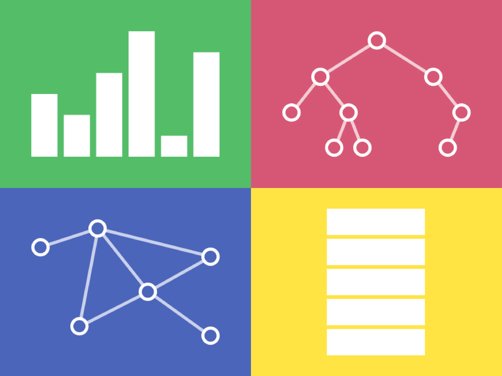

# Algo Visualizer

This is a project built for beginners to learn how different algorithms work in a fun and visual way

## Algorithms Visualuized

    - Sorting
        - Bubble Sort
        - Insertion Sort
        - Selection Sort
        - Merge Sort
        - Quick Sort
    - Scheduling
        - FCFS Scheduling
        - SJF Scheduling
        - Priority Scheduling
        - Round Robin Scheduling
    - Graph Traversal
        - DFS
        - BFS
        - Dijkstras
        - Prims MST
    - N Queens
    - Searching
        - Linear Search
        - Binary Search
    - Tree
        Contains only BST operations
    - Stack
        Contains only Stack operations
    - Queue
        Contains only Queue operations

## In Order to Run The Code In Your Machine

----------

## 1. Make Sure You have Git installed

## 2. Create a New Folder

`mkdir folder_name`

## 3. Clone the repository

`git clone https://github.com/ashwin-athappan/algo-visualizer.git`

## 4. Install The Required Packages

`yarn install`

## 5.Check for database integrity 

    cd server
    npx prisma migrate dev --name name_of_migration
    cd ..

## 6. Run the project

`yarn start` - start client

`yarn run server` - start server